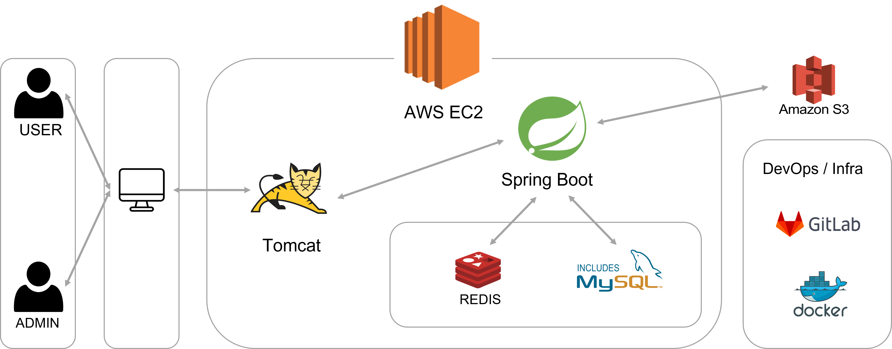
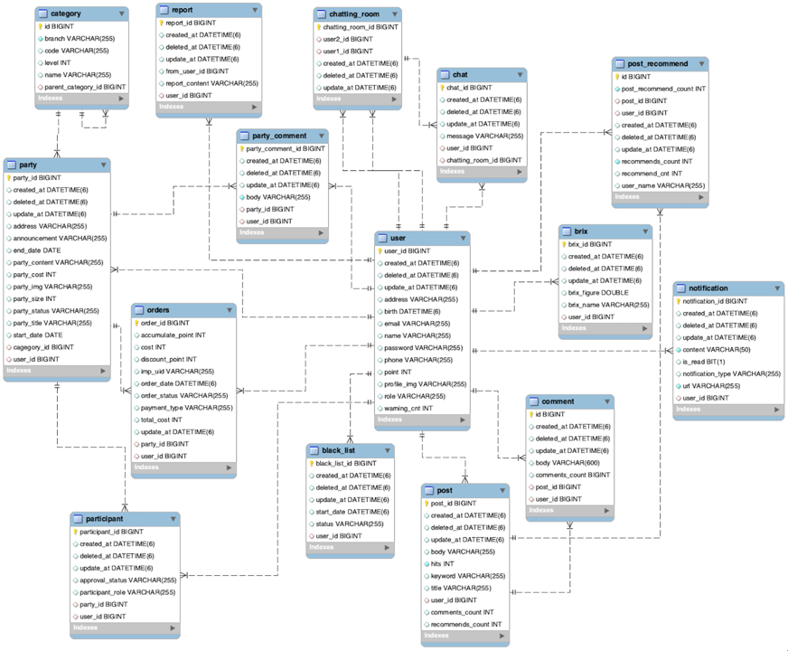

# 🍍PinePeople

### 소개

> 파인피플이란 영화를 함께 보거나, 배달료를 나누는 당장의 만남부터
OTT를 함께 결제하거나, 스터디를 만드는 꾸준함 만남까지 누군가 필요할 때 언제든지 사람을 찾을 수 있는 기능을 제공하는 웹서비스입니다.
>

 

### 구성원

- 박수진(PM)
- 서정희
- 이아진
- 김진아
- 김지수

 

### PinePeople 실행방법

아래의 환경변수를 설정한 후 실행

| No | 환경변수 | 값 |
| --- | --- | --- |
| 1 | IMP_KEY | 아임포트 결제 api key |
| 2 | IMP_SECRET | 아임포트 결제 api secret key |
| 3 | OAUTH_CLIENT_ID | 구글 클라이언트 ID |
| 4 | OAUTH_CLIENT_SECRET | 구글 클라이언트 secret key |
| 5 | REDIS_HOST | Redis host 주소 |
| 6 | S3_ACCESS_KEY | 아마존 S3 access key |
| 7 | S3_BUCKET | 아마존 S3 bucket key |
| 8 | S3_SECRET_KEY | 아마존 S3 secret key |
| 9 | SMS_KEY | cool SMS api key |
| 10 | SMS_PHONE | cool SMS api 발신 대표 번호 |
| 11 | SMS_SECRET | cool SMS api secret key |
| 12 | SPRING_DATASOURCE_PASSWORD | mysql 패스워드 |
| 13 | SPRING_DATASOURCE_URL | mysql 호스트 주소 |

 

### 프로젝트 URL

📜 [PinePeople  노션 URL](https://www.notion.so/22c235d2439f45c0a0601e75664babb0)

🚧 [PinePeole ERD Cloud URL](https://www.erdcloud.com/d/faY3ovvTNDFa7zzsj)

📌 [PinePeople Swagger URL](http://pinepeople.site:8080/swagger-ui/index.html)

🍍 [PinePeople 웹서비스 URL](http://pinepeople.site:8080/pinepeople)

 

### 기술 스택

- 에디터 : Intellij Ultimate
- 개발 툴 : Spring Boot 2.7.7
- 자바 : JAVA 11
- 빌드 : Gradle
- 서버 : AWS EC2, AWS S3
- 데이터베이스 : MySql 8.0
- 프론트엔드 :  HTML/CSS/JavaScript, Thymeleaf

 

### Work Flow

 

### ERD

 

### API 명세서 및 URL 명세서

✏️ [REST API 명세서](https://www.notion.so/e7dd562f87624ecca98ba67fd99084dd)

✒️ [UI URL 명세서](https://www.notion.so/8ec5eac350b340b1aa595a20a60fbdf0)

 

### 기능 리스트

**User**

- 회원가입, 로그인, 로그아웃
- 유저 정보 수정, 탈퇴
- 유저 리스트 조회, 상세 조회, 검색
- 유저 마이페이지
- 유저 신고

Party

- 파티 카테고리 생성, 수정, 삭제
- 파티 카테고리에 따른 파티 검색
- 파티 생성, 수정, 삭제
- 파티 리스트 조회, 상세 조회, 검색
- 참가한 파티 조회 및 대기 중인 파티 조회
- 파티 댓글 작성, 조회, 삭제
- 파티원 생성, 수정, 탈퇴
- 파티원 전체 조회, 승인 대기 중인 파티원 조회

당도

- 유저 당도 평가
- 유저 당도 조회

결제

- 파티 가입비 결제
- 결제 취소

커뮤니티

- 자유 게시판 글 작성, 수정, 삭제
- 게시판 댓글 작성, 삭제

ADMIN

- 블랙리스트 대기 승인 및 반려
- 블랙리스트 조회 및 검색
- 유저 관리자 등급 변경

알람

- 파티 댓글, 포스트 댓글 알람
- 파티원 승인 및 거절 알람

 

### Weekly Log

| 주차 | 위클리 주소                                                                                                                                                                                                               |
| --- |----------------------------------------------------------------------------------------------------------------------------------------------------------------------------------------------------------------------|
| 1 | [1주차 Weekly](https://gitlab.com/GunLABS/pine-people/-/blob/developer/Weekly_Log/%5B1%EC%A3%BC%EC%B0%A8%5D%ED%8C%8C%EC%9D%B8%ED%94%BC%ED%94%8C_7%ED%8C%80_%EC%A7%84%ED%96%89%EC%83%81%ED%99%A9_%EA%B3%B5%EC%9C%A0.md) |
| 2 | [2주차 Weekly](https://gitlab.com/GunLABS/pine-people/-/blob/developer/Weekly_Log/%5B2%EC%A3%BC%EC%B0%A8%5D%ED%8C%8C%EC%9D%B8%ED%94%BC%ED%94%8C_7%ED%8C%80_%EC%A7%84%ED%96%89%EC%83%81%ED%99%A9_%EA%B3%B5%EC%9C%A0.md) |
| 3 | [3주차 Weekly](https://gitlab.com/GunLABS/pine-people/-/blob/developer/Weekly_Log/%5B3%EC%A3%BC%EC%B0%A8%5D%ED%8C%8C%EC%9D%B8%ED%94%BC%ED%94%8C_7%ED%8C%80_%EC%A7%84%ED%96%89%EC%83%81%ED%99%A9_%EA%B3%B5%EC%9C%A0.md) |
| 4 | [4주차 Weekly](https://gitlab.com/GunLABS/pine-people/-/blob/developer/Weekly_Log/%5B4%EC%A3%BC%EC%B0%A8%5D%ED%8C%8C%EC%9D%B8%ED%94%BC%ED%94%8C_7%ED%8C%80_%EC%A7%84%ED%96%89%EC%83%81%ED%99%A9_%EA%B3%B5%EC%9C%A0.md) |